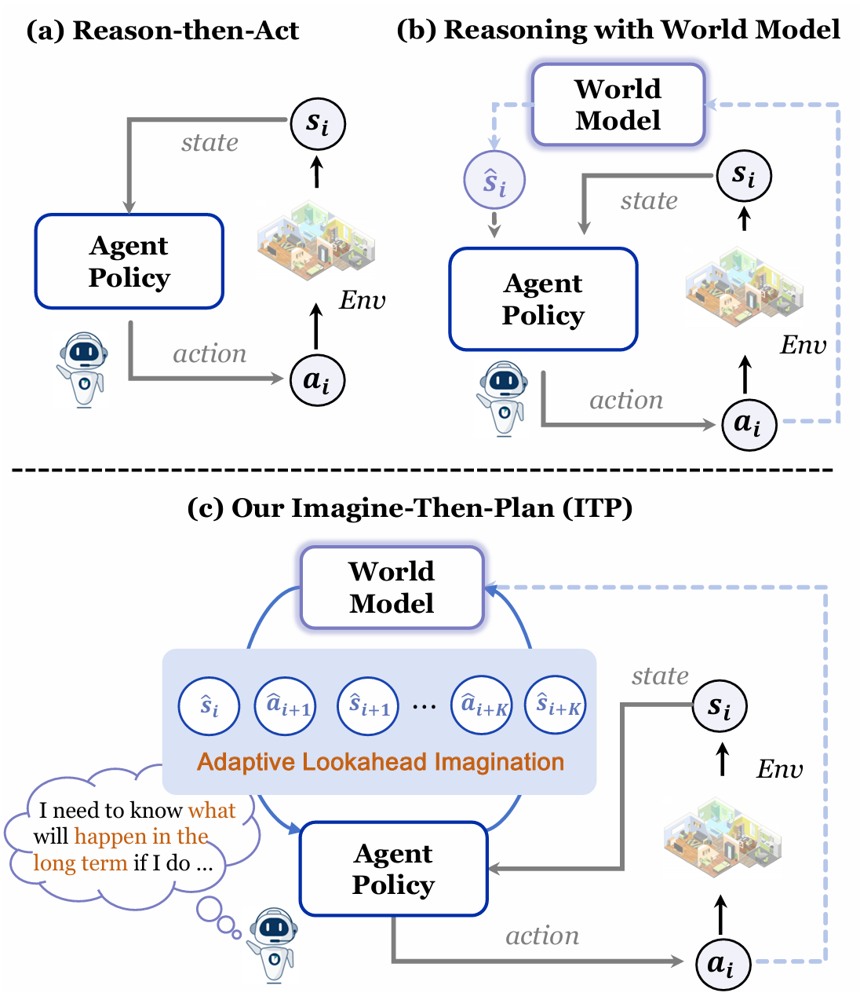
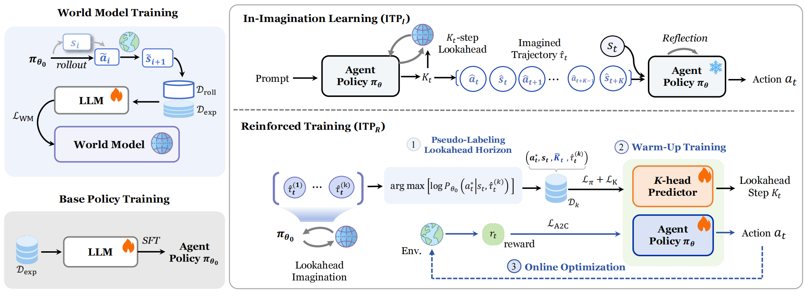
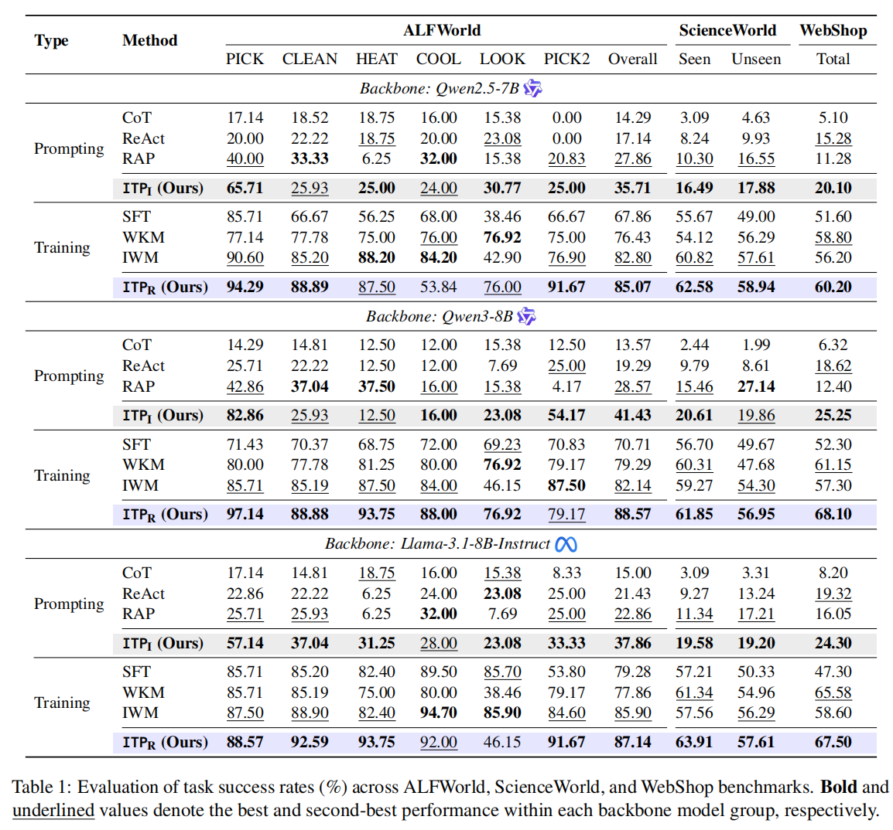

<h1 align="center">🧠 Imagine-then-Plan (ITP): Agent Learning from Adaptive Lookahead with World Models</h1>

<div align="center">

[](https://arxiv.org/pdf/2601.08955)
[](https://huggingface.co/papers/2601.08955)
[](#-latest-news)
[](LICENSE)
[](https://www.python.org/downloads/)


<p align="center">
  
</p>
</div>


<h5 align="center">If you like our project, please give us a star ⭐ on GitHub for the latest updates.</h5>

---

## 📣 Latest News
- **[Jan 15, 2026]**: 📄 Paper released on **arXiv** and **Hugging Face Papers**.
- **[Jan 18, 2026]**: 🚀 Code release (release-oriented packaging, prompts, and core modules).
- **[Coming Soon]**:
  - [ ] 📦 Processed data release
  - [ ] 🧊 Training checkpoints release (World Model / ITP_R)

---


## 📝 Contents

- [Setup](#setup)
- [Usage](#usage)
  - [World Model Training](#world-model-training)
  - [ITP_R Training](#itp-r-training)
  - [Evaluation](#evaluation)
- [Experimental Results](#experimental-results)
- [Contact](#contact)
- [Citation](#citation)

<!-- ========== Anchors (place these RIGHT ABOVE the corresponding headings) ========== -->

<a id="setup"></a>
<!-- Put this line right above: ## 🔧 Installation -->

<a id="usage"></a>
<!-- Put this line right above: ## Usage -->

<a id="world-model-training"></a>
<!-- Put this line right above: ### 🧠 World Model Training（FastChat SFT, Sec. 3.1） -->

<a id="itp-r-training"></a>
<!-- Put this line right above: ### 🎛️ ITP_R Training（Adaptive Lookahead, Sec. 3.3） -->

<a id="evaluation"></a>
<!-- Put this line right above: ### 🧪 Evaluation -->

<a id="experimental-results"></a>
<!-- Put this line right above: ## Experimental Results -->

<a id="contact"></a>
<!-- Put this line right above: ## 📞 Contact -->

<a id="citation"></a>
<!-- Put this line right above: ## 📄 Citation -->


## 💡 Overview

<p align="center">
  
</p>

Modern LLM agents often behave **reactively**: they decide actions from the current observation and short history, which can be brittle for **long-horizon** tasks. ITP addresses this by introducing a learned **textual world model** and an **adaptive lookahead** mechanism, enabling the agent to **mentally rehearse** possible futures before committing actions in the real environment.

### 🧠 POIMDP-Style Reasoning with Imagination

ITP treats decision making as reasoning with both:
- the current observable state (text observation), and
- an imagined multi-step future trajectory produced by the world model.

At each step, the agent can invoke the world model to simulate several steps ahead (a “mental sandbox”), then use that foresight to refine the final action choice.

### 🧩 Two Instantiations: ITP_I and ITP_R

#### 🔍 ITP_I (Training-free, In-Imagination Learning)

ITP_I enhances an LLM agent *at inference time* without parameter updates. The agent follows a three-stage **Imagine-then-Plan** procedure at each step:

1) **Adaptive horizon selection**: decide how many steps to look ahead (K) based on the task and current situation.  
2) **World-model imagination**: roll out K steps to obtain a foresight trajectory.  
3) **Reflect-then-act**: reflect on the foresight (progress, risks, constraints) and then output the real action.

#### 🧪 ITP_R (Reinforcement-trained, Adaptive Lookahead Learning)

ITP_R learns *when* and *how long* to imagine by adding a lightweight **K-head predictor** on top of the backbone LLM and training it with a three-stage pipeline:

1) **Pseudo-labeling horizons**: derive training targets for K by selecting the most helpful lookahead depth under a cost trade-off.  
2) **Warm-up training**: jointly train the action policy (imitation) and the K-head (classification/regression).  
3) **Online A2C optimization**: optimize the action policy + K-head + value head online with actor–critic training while the world model is frozen.


---

## 🔧 Installation

This section installs dependencies and then gives a **repository tour** so you can quickly locate:
- ITP_I (inference-time): select K → imagine → reflect-and-act
- ITP_R (reinforcement-trained): pseudo-label → warm-up → online A2C (policy + K-head + value head)
- World Model training + rollout interface
- Prompt templates used by the above modules

---

### 🐍 1) Environment Setup (Recommended)

We recommend **conda** with **Python 3.9+**.

~~~bash
# Create a clean environment
conda create -n itp python=3.9 -y
conda activate itp

# (Optional) upgrade pip tooling
python -m pip install --upgrade pip setuptools wheel
~~~

---

### 📦 2) Install Python Packages

~~~bash
# From the repository root
pip install -r requirements.txt

# (Recommended) install as editable for local development
pip install -e .
~~~

---


## Usage


### 🧠 World Model Training（FastChat SFT, Sec. 3.1）

~~~bash
conda activate <ENV_WITH_DEEPSPEED>

export MODEL_PATH="path/to/base_lm"
export DATA_PATH="path/to/wm_train.jsonl"
export OUTPUT_DIR="outputs/wm_run"
export DS_CONFIG="world_model/base_tuning/config/deepspeed_config_s2.json"

bash world_model/base_tuning/run_worldmodel_tuning.sh
~~~

Output worldmodel is located at:

~~~bash
${OUTPUT_DIR}/merged_full
~~~

---

### 🎛️ ITP_R Training（Adaptive Lookahead, Sec. 3.3）


#### 1) Stage-I：Pseudo-K Labeling

~~~bash
python -u -m itp.training.train_adaptive_k label \
  --expert_jsonl "path/to/expert_rollouts.jsonl" \
  --policy_model_path "path/to/policy_base_or_sft" \
  --wm_model_path "path/to/wm_merged_full" \
  --out_labeled_jsonl "outputs/itp_r/labeled.jsonl" \
  --kmax 5 \
  --k_candidates "0,1,2,3,4,5" \
  --lambda_k 0.2 \
  --wm_max_new_tokens 192 \
  --max_seq_len 1536 \
  --padding_side left \
  --logprob_norm sum
~~~

#### 2) Stage-II：Warm-up SFT（k-head supervised）

~~~bash
python -u -m itp.training.train_adaptive_k sft \
  --train_jsonl "outputs/itp_r/labeled.jsonl" \
  --policy_model_path "path/to/policy_base_or_sft" \
  --out_dir "outputs/itp_r/policy_sft_khead" \
  --kmax 5 \
  --epochs 1 \
  --batch_size 2 \
  --grad_accum 8 \
  --lr 2e-5 \
  --wd 0.0 \
  --beta_k 1.0 \
  --max_seq_len 1536 \
  --bf16 \
  --train_only_heads \
  --padding_side left
~~~

#### 3) Stage-III：Online A2C（rl_k）

~~~bash
conda activate <ENV_WITH_ALFWORLD>
export TOKENIZERS_PARALLELISM=false

python -u -m itp.training.train_adaptive_k rl_k \
  --policy_model_path "outputs/itp_r/policy_sft_khead" \
  --out_dir "outputs/itp_r/policy_rlk" \
  --alfworld_config "eval_agent/data/alfworld/base_config.yaml" \
  --env_data_path "eval_agent/data/alfworld" \
  --env_split "valid_seen" \
  --wm_model_path "path/to/wm_merged_full" \
  --wm_max_new_tokens 192 \
  --policy_device "cuda:0" \
  --wm_device "cuda:1" \
  --kmax 5 \
  --epochs 1 \
  --episodes_per_epoch 50 \
  --max_steps 50 \
  --gamma 0.99 \
  --lr 5e-6 \
  --wd 0.0 \
  --lambda_k 0.2 \
  --step_cost 0.0 \
  --success_bonus 0.0 \
  --invalid_action_penalty -0.1 \
  --entropy_coef 0.01 \
  --value_coef 1.0 \
  --max_grad_norm 1.0 \
  --action_max_new_tokens 16 \
  --action_do_sample 1 \
  --imagine_action_max_new_tokens 12 \
  --max_seq_len 1536 \
  --history_keep_steps 6 \
  --padding_side left \
  --logprob_norm sum \
  --bf16 \
  --train_only_heads
~~~

---

### 🧪 Evaluation

#### 1) ALFWorld（ITP_I / RAP）

~~~bash
export POLICY_MODEL="path/to/policy_checkpoint"
export WM_MODEL="path/to/wm_merged_full"
export OUT_DIR="outputs/eval/alfworld_seen"

mkdir -p "${OUT_DIR}"

python -u -m foresight_eval \
  --method foresight \
  --split seen \
  --env_data_root "eval_agent/data/alfworld" \
  --policy_model "${POLICY_MODEL}" \
  --wm_model "${WM_MODEL}" \
  --wm_backend local \
  --output_path "${OUT_DIR}" \
  --max_steps 40 \
  --max_k 5 \
  --fixed_k -1 \
  --use_history 0 \
  --decision_tokens 16 \
  --act_tokens 256 \
  --foresight_tokens 256 \
  --prefer_goal_action 1 \
  --force_admissible_action 1 \
  --heuristic_fallback 1
~~~


#### 2) ScienceWorld（ITP_I）

~~~bash
export SCIENCEWORLD_JAR="path/to/scienceworld.jar"
export POLICY_MODEL="path/to/policy_checkpoint"
export WM_MODEL="path/to/wm_merged_full"
export OUT_DIR="outputs/eval/sciworld_test"

mkdir -p "${OUT_DIR}"

python -u -m foresight_eval.runner_sciworld \
  --split test \
  --jar_path "${SCIENCEWORLD_JAR}" \
  --policy_model "${POLICY_MODEL}" \
  --wm_model "${WM_MODEL}" \
  --output_path "${OUT_DIR}" \
  --wm_backend local \
  --policy_device "cuda:0" \
  --wm_device "cuda:1" \
  --policy_dtype fp16 \
  --wm_dtype fp16 \
  --max_k 3 \
  --fixed_k -1
~~~


## Experimental Results

<p align="center">
  
</p>

Evaluation of task success rates(%) across ALFWorld and ScienceWorld benchmarks. Bold and underlined
values represent the best and second-best performance within each backbone model group,respectively.

## 📞 Contact

For any questions, please reach out to us at [loyiv5477@gmail.com](loyiv5477@gmail.com).

## 📄 Citation

If you find this work helpful, please cite our paper:

```bibtex
@article{liu2026itp,
  title        = {Imagine-then-Plan: Agent Learning from Adaptive Lookahead with World Models},
  author       = {Youwei Liu and Jian Wang and Hanlin Wang and Beichen Guo and Wenjie Li},
  journal      = {arXiv preprint arXiv:2601.08955},
  year         = {2026},
  url          = {https://arxiv.org/abs/2601.08955}
}
